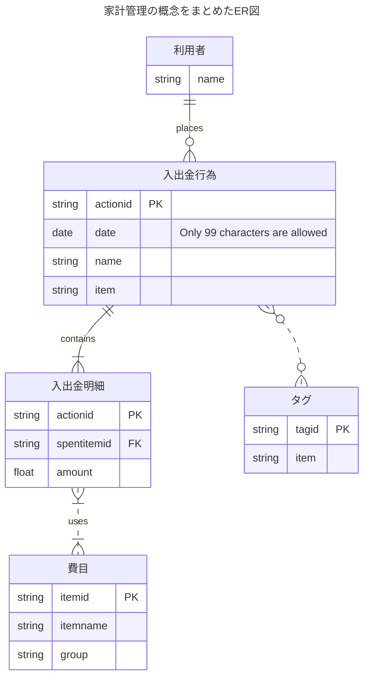

### ER図の記述形式は２つある。
- IE（Information Engineering）：ジェームズ・マーチン考案
- IDEF1X ：アメリカ空軍開発
### ER図のエンティティに記載するものは以下の４つ。
- エンティティ名
- 属性
- 主キー（PK）
- 外部キー（FK）
### エンティティ間にリレーションシップがある場合はエンティティ同士をつなぐ。
エンティティ同士の数量的な関係を多重度やカーディナリティという。

|Value (left)|Value (right)|Meaning|
|---|---|---|
|`\|o`|`o\|`|Zero or one|
|`\|`|`\|`|Exactly one|
|`}o`|`o{`|Zero or more (no upper limit)|
|`}\|`|`\|{`|One or more (no upper limit)|

参考：
[[mermaidの書き方]]
