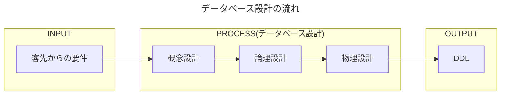
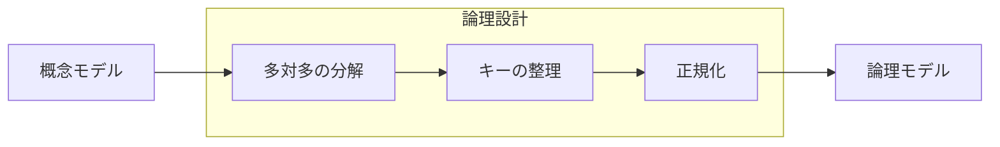

## データベース設計の流れ

   - 概念設計
	 管理すべき情報の整理。要件に登場する情報をざっくり把握。
	 情報同士の関連も合わせて整理。
   - 論理設計
	 概念設計の情報をRDB前提で構造を整理、具体化。
	 テーブルや列までで十分。型や制約は含めない。
   - 物理設計
	 特定のDBMSを使う前提にたち、論理設計の情報を具体化する。
	 この物理設計に基づいて、DDLを作成する。
## 概念設計
要件を実現するために、抽象的な概念として管理すべき「情報の塊」を明らかにする。

情報の塊をエンティティといい、エンティティは通常複数の属性を持つ。またエンティティ同士の関連も概念設計で明らかにする。
>[!tip]+ 概念イメージ
>エンティティ：テーブルのようなもの
>属性：列のようなもの  
>関連：リレーションのようなもの

概念設計の成果は[ER図](01.Inbox/ER図.md)（ERD：entity-relationship diagram）と呼ばれる図にまとめるのが一般的。 ER図を使うと、エンティティ、属性、リレーションシップを俯瞰してみることができる。
## 論理設計
概念上のエンティティをリレーショナルデータモデルで取り扱いやすい形のテーブルに変形する。

### 多対多の分解
リレーショナルデータベースでは多対多の関係はうまく扱えないため、２つのエンティティの対応を格納した中間テーブル（連関エンティティ）を追加して、多対多を２つの１対多の関係変換する。
### キーの整理
### 正規化
#### 正規化の手順

##### 正規化の段階
##### 非正規形
##### 第一正規形への変形
##### 関数従属性
##### 第二正規形への変形
##### 第三正規形への変形
##### 正規化を覚えるコツ
##### トップダウンとボトムアップの統合
## 物理設計
論理設計後、どのDBMSを利用するか確定したうえで行うのが物理設計。全テーブルについて詳細な設計を確定させる。完成した物理モデルはそのままDDLに変換できる内容となる。

論理モデル　→　物理名の決定　→　型・制約の決定　→　インデックスの決定　→　物理モデル

①最終的なテーブル名、列名を決定する
②列の型を決定する
③制約、デフォルト値を決定する
④インデックスを決定する
⑤その他
